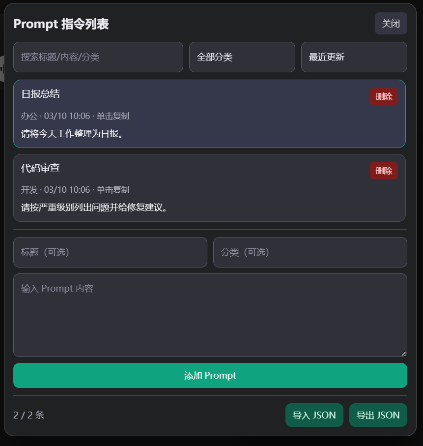

# ChatGPT Conversation Toolkit 🧰✨

适用于 ChatGPT Web 端的实用插件，聚焦长会话浏览、导出、搜索、Prompt 管理和时间线导航。🚀

## 更新日志 📝

- `2026.02.06` 修复收起 icon 按钮位置 bug，修复恢复隐藏消息 bug，新增搜索跳转功能。🛠️
- `2026.03.10` 新增 Prompt 指令库（搜索、分类、排序、添加、删除、导入/导出 JSON、单击复制）。📚
- `2026.03.11` 新增时间线功能（节点跳转、悬停预览、滚动、计数、显示/隐藏、拖拽移动、气泡位置自适配）。🕒

## 功能总览 🎯

- 🚀 **优化长会话卡顿**：一键隐藏旧消息，减少页面渲染压力。
- 📦 **一键导出当前会话**：导出为 JSON 文件，包含所有消息内容。
- 🔍 **搜索跳转**：支持搜索消息并跳转到对应位置。
- 📚 **Prompt 指令库**：支持 Prompt 的新增、删除、搜索、分类、排序、导入/导出 JSON、单击复制。
- 🕒 **对话时间线**：支持按节点快速定位消息、预览、计数、拖拽移动时间线面板。

## 功能说明 🔧

1. **🚀 优化长会话卡顿**
   - 点击「优化长会话」后，会隐藏较早消息，仅保留最新 `20` 条。
   - 需要查看完整内容时，可点击「恢复隐藏消息」。

2. **📦 一键导出当前会话全部消息**
   - 点击「一键导出」会自动生成 JSON 并下载。
   - 即使执行过优化，导出仍会包含隐藏的旧消息。

3. **🔍 搜索跳转**
   - 搜索框输入关键词即可检索消息内容。
   - 支持高亮匹配结果，并用上下按钮快速切换。

4. **🧲 浮层收起与拖动**
   - 点击右上角「收起」按钮，工具浮层会变成圆形按钮。
   - 圆形按钮可自由拖动，释放后自动贴边；点击可展开。

5. **📚 Prompt 指令库**
   - 点击「Prompt 指令」按钮打开弹窗。
   - 支持按关键词搜索、按分类筛选、按更新时间/标题/分类排序。
   - 支持新增 Prompt、删除 Prompt、导入 JSON、导出 JSON。
   - 单击列表项可直接复制 Prompt 内容，复制成功会有提示。

6. **🕒 时间线导航（新增）**
   - 仅加载“当前页面已加载”的用户消息节点，不会主动加载未渲染消息。
   - 头部显示节点计数：`当前节点/总用户节点数`。
   - 悬停节点可预览消息，点击节点可跳转到对应消息。
   - 鼠标滚轮用于滚动时间线；页面滚动会同步激活对应时间节点。
   - 滚到时间线顶部无更多可见消息时，会提示 `已经没有消息了`；若消息被优化隐藏，则提示 `请恢复隐藏消息`。
   - 可按住时间线头部（标题+计数）拖拽到任意位置。
   

## 安装方式 🧩

### Firefox 🦊

1. 打开 `about:debugging`，或 `about:debugging#/runtime/this-firefox`。
2. 点击「此 Firefox」→「临时载入附加组件」。
3. 选择本项目根目录下的 `manifest.json`。

### Microsoft Edge 🌐

1. 打开管理扩展程序页，或访问 `edge://extensions`。
2. 开启右上角「开发人员模式」。
3. 点击「加载已解压的扩展」并选择本项目根目录。

### Google Chrome 🌈

1. 打开管理扩展程序页，或访问 `chrome://extensions/`。
2. 开启右上角「开发人员模式」。
3. 点击「加载已解压的扩展」并选择本项目根目录。

## 使用方法 ▶️

1. 打开 `https://chat.openai.com/` 或 `https://chatgpt.com/` 的对话页面。
2. 页面右下角会出现「ChatGPT 工具」浮层。
3. 点击按钮执行优化、导出、搜索、Prompt 指令管理、时间线显示/隐藏。
4. 在左侧时间线可进行滚动预览、节点跳转和拖拽移动。🧭




## 请作者喝杯奶茶 🧋

如果这个插件对你有用，欢迎顺手点个 Star ⭐，真的非常感谢！


## 可选配置 ⚙️

如需调整会话与时间线参数，可在 `contentScript.js` 中修改：

```js
const state = {
  isCollapsed: false,
  keepLatest: 20, // 会话优化后保留的最新消息数量
  collapsedNodes: [],
  cachedNodes: [],
};

const TIMELINE_VISIBLE_NODE_CAPACITY = 10; // 时间线单屏可视容量
const TIMELINE_MAX_NODES = 20; // 时间线最大采样节点数
```

## 文件说明（非开发可跳过）📁

- `manifest.json`：插件清单文件，定义脚本注入范围与权限（含 `storage`）。
- `contentScript.js`：核心逻辑（优化长会话、导出会话、搜索跳转、Prompt 指令库、时间线）。
- `styles.css`：工具浮层、Prompt 弹窗、时间线组件样式。
- `image`：README 示例图片资源。

## 会话导出 JSON 格式 📦

```json
{
  "exportedAt": "2026-03-10T08:30:00.000Z",
  "url": "https://chatgpt.com/c/xxxxxxxx",
  "messageCount": 2,
  "messages": [
    {
      "index": 1,
      "role": "user",
      "text": "你的消息"
    },
    {
      "index": 2,
      "role": "assistant",
      "text": "ChatGPT 的消息"
    }
  ]
}
```

字段说明：

- `exportedAt`：导出时间，ISO 8601（UTC）。
- `url`：会话页面链接。
- `messageCount`：导出的消息数量。
- `messages`：消息数组。
- `messages[].index`：消息序号（从 1 开始）。
- `messages[].role`：消息角色（`user` / `assistant` / `unknown`）。
- `messages[].text`：消息文本内容。

## Prompt 指令库 JSON 格式 📚

Prompt 指令库导出文件为 JSON 对象，结构如下：

```json
{
  "version": 1,
  "updatedAt": "2026-03-10T08:30:00.000Z",
  "prompts": [
    {
      "id": "c94f7299-40f3-4f95-a9f7-0ff93029a3f8",
      "title": "日报总结",
      "category": "办公",
      "content": "请将今天工作整理为日报，按完成项、风险、计划输出。",
      "createdAt": 1741576200000,
      "updatedAt": 1741576200000
    }
  ]
}
```

字段说明：

- `version`：版本号，当前固定为 `1`。
- `updatedAt`：库级更新时间（ISO 8601）。
- `prompts`：Prompt 列表。
- `prompts[].id`：Prompt 唯一 ID（字符串）。
- `prompts[].title`：Prompt 标题。
- `prompts[].category`：Prompt 分类。
- `prompts[].content`：Prompt 正文内容。
- `prompts[].createdAt`：创建时间（毫秒时间戳）。
- `prompts[].updatedAt`：更新时间（毫秒时间戳）。

### 导入兼容格式 🔄

支持以下两种 JSON 结构：

1. 对象格式（推荐）✅

```json
{
  "prompts": [
    {
      "title": "代码评审",
      "category": "开发",
      "content": "请按严重级别列出问题并给修复建议。"
    }
  ]
}
```

2. 数组格式 ✅

```json
[
  {
    "title": "需求拆解",
    "category": "产品",
    "content": "请拆解为任务并给出优先级和验收标准。"
  }
]
```

导入规则：

- `content` 为空的记录会被忽略。
- `title` 为空时会自动根据 `content` 生成标题。
- `category` 为空时会自动归类为 `未分类`。
- 重复项按 `title + category + content` 去重（大小写不敏感）。
